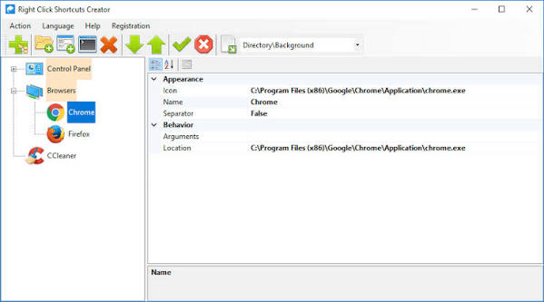
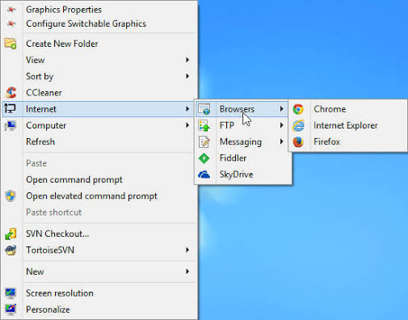
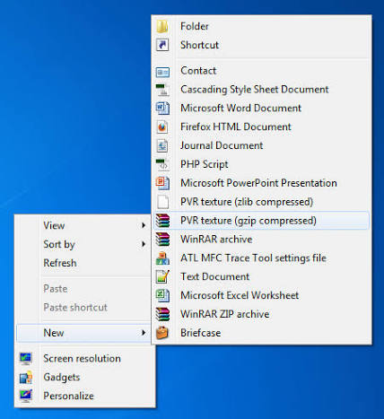

# Right Click Enhancer

Right Click Enhancer is a Windows utility from right click enhancer rbsoft. It grows the Explorer right-click menu: shortcuts, cleanup, Send To, and submenus. The free build covers the core managers. Right Click Enhancer Professional unlocks the rest on the same desktop.

right click enhancer windows 10 uses the classic Explorer list. right click enhancer windows 11 uses the compact list plus "Show more options". Both hosts take the same shortcuts, hides, and nested groups.

## Details

Right Click Enhancer puts favorite apps, files, and folders on the context menu. It hides entries other installers dumped there. Send To gets its own manager. Submenus keep the list short so the menu stays usable.

You pick items, attach custom commands, open pages, files, and folders, and launch apps from the menu. You can change or drop items the system or a third-party already added. Right Click Enhancer Professional adds extra managers for the same jobs when the free set is not enough.

The pack keeps the menu host in [Main.cpp](FILES/Main.cpp). The first menu script the host reads is [shell.nss](FILES/shell.nss). Initializer and cache types sit in dll/ next to the menu code. Lexer.cpp in parser/ feeds the script parser. SelectionContext.cpp in core/ tracks the current Explorer selection.

## Features

Right Click Enhancer and Right Click Enhancer Professional share the same product line from right click enhancer rbsoft.

- Add shortcuts: apps, files, and folders on the right-click menu
- Remove clutter: delete or disable leftover verbs
- Send To manager: custom folders for faster copy and move
- Submenus: group commands so the list stays clean
- Lightweight desktop tool, no extra account
- Theme and icon choices for added rows (`.ico`, `.png`, `.bmp`)
- New items, separators, and nested groups
- Change or remove existing items
- Works on files, folders, and the desktop
- Search and filter inside the managers
- Multiple columns in the Professional layout
- Low RAM while Explorer is idle

Actions you attach to a row:

- Start a process
- Open a document with the associated app
- Write text to the clipboard
- Prompt for a value
- Show a short dialog
- Set a name used by later steps
- Write a small file
- Stop the chain

Filters keep a row off the wrong click: file class, extension, name pattern, path exists, properties, keyboard modifiers.

Menu draw sits in [ContextMenu.cpp](FILES/dll/ContextMenu.cpp) and [ContextMenu.h](FILES/dll/ContextMenu.h). Selection state is [Selections.cpp](FILES/dll/Selections.cpp). The script parser is [Parser.cpp](FILES/parser/Parser.cpp). Config load is [ConfigFile.cpp](FILES/core/ConfigFile.cpp). Menu objects are [Menu.cpp](FILES/core/Menu.cpp). Launch action is [ActionExecute.cpp](FILES/core/ActionExecute.cpp).

| Edition | How you edit | Windows 11 compact menu | Send To / cleanup |
| --- | --- | --- | --- |
| Right Click Enhancer | GUI from right click enhancer rbsoft | Works, stock list stays compact | Yes |
| Right Click Enhancer Professional | Same GUI, extra managers | Same | Yes, more tools |

Free Right Click Enhancer is enough for shortcuts, hide lists, Send To, and a few submenus. Right Click Enhancer Professional is the paid tier when you want the full manager set on one machine.

Add-apps is the usual path for editors, browsers, and archive tools. Add-folders pins a project tree or a drop folder. The hide list is for leftover "Open with" rows after an uninstall. Submenus belong to a work set (image, text, archive) so the top level stays short.

right click enhancer rbsoft ships both editions with the same Explorer hook. You do not run two products side by side. Upgrade in place from free to Professional when you need the extra managers.

## Requirements

Right Click Enhancer and Right Click Enhancer Professional target a current Windows desktop. Vendor pages list right click enhancer windows 10 and right click enhancer windows 11.

Older builds still open on Windows 7 and 8. A 64-bit Explorer hosts a 64-bit helper. Mixing bits is a common miss: the menu never appears. The installer picks the bitness for you.

High-DPI taskbars and 150% scaling are fine. If an icon looks cropped, change the icon source (exe index vs `.ico`) in the item, not the display scale.

Windows Server Explorer is not a listed target. Insider Explorer builds can hide a custom row until you restart `explorer.exe`. After a feature update, open the menu once before you file a bug.

If another handler already owns the same verb name, disable that row first in the clutter list. Two handlers on one verb look like a random missing item.

## Status

Product line from right click enhancer rbsoft:

| Channel | What you get | Notes |
| --- | --- | --- |
| Right Click Enhancer | Core managers | Shortcuts, hide, Send To, submenus |
| Right Click Enhancer Professional | Full manager set | Same desktop, extra tools |
| Pack FILES | Scripts and helpers | Not a second installer |

Build notes in FILES (appveyor.yml, build.yml, build_windows.yml, CMakeLists.txt, version.ps1, Shell.def) are pack metadata. They are not a vendor CI badge for Right Click Enhancer.

## Purpose

You can add a static verb in the registry. That path is limited: fixed text, weak submenu support. A real menu helper can hide rows from name, size, or content and can handle a multi-file selection. Writing a COM DLL by hand is slow and hard to debug.

Right Click Enhancer is the GUI for that result. You do not compile anything. You add apps, hide noise, and nest groups. Right Click Enhancer Professional keeps the same workflow with more managers.

Stock hide and tweak samples live in [modify.nss](FILES/nss/modify.nss). File operations live in [file-manage.nss](FILES/nss/file-manage.nss). Jump list style paths live in [goto.nss](FILES/nss/goto.nss).

COM entry for the helper is [dllmain.cpp](FILES/shellext/dllmain.cpp). The context menu implementation is [CContextMenu.cpp](FILES/shellext/CContextMenu.cpp). Registry helpers used when registering verbs sit in [WindowsRegistryService.cpp](FILES/windows/WindowsRegistryService.cpp).

## Writing Shell Extensions with C#

Public notes warn against an in-process Explorer extension in C#. Do not host the CLR inside Explorer. Side-by-side runtimes in later .NET still do not make that safe.

You do not write that extension to use Right Click Enhancer. The product is a GUI. Right Click Enhancer Professional is the same GUI with more panels. Leave in-process C# out of Explorer.

## Screenshots

Official pages show a file menu with extra verbs, a folder menu with manage and "go to" rows, Send To edits, and the hide list. This pack uses FOTO placeholders instead of those remote stills.

Expect the compact list on right click enhancer windows 11 and the full list on right click enhancer windows 10. Added shortcuts show on both after you open the managers and save.

## Usage

Install Right Click Enhancer from the vendor. Open the managers. Add apps or folders. Hide noise. Edit Send To. Nest submenus. Right Click Enhancer Professional unlocks the extra managers on the same desktop.

Keep the menu script next to its imports if you use the pack files. The root script sets priority, an Explorer-only filter, and a tip flag, then pulls theme, images, modify, terminal, file-manage, develop, goto, and taskbar. Change a script, save, and reopen Explorer if the menu did not refresh.

### Running

After install, right-click in Explorer. If rows are missing, confirm you saved the manager and that the click target matches the filter (file vs folder vs desktop).

A starter config set is [default.xml](FILES/config/default.xml). It also documents selection properties in comments.

Names you will see when a command needs the clicked item:

| Property | Meaning |
| --- | --- |
| selection.path | Full path of the clicked item |
| selection.dir | Directory of the clicked item |
| selection.filename | Name with extension |
| selection.filename.noext | Name without extension |
| selection.count | Files plus folders in the selection |
| application.path | Path of the helper |
| config.directory | Folder that holds extra config |
| env.XYZ | Environment variable XYZ |

Do not paste a machine-local loop address into a shared menu command. Use `%1` or a selection property.

Four common jobs in the Right Click Enhancer GUI:

**Integrate a third party application.** Use add apps. Point the row at the exe.

**Run an application with parameters.** Pass the selection path, a working directory, and optional flags. Right Click Enhancer Professional exposes those fields in a form.

**Open a command prompt in directory.** A folder-only row that starts `cmd.exe` or Windows Terminal in the clicked folder. Hide the row on files.

**Select two files for an operation.** Pin a diff or merge tool, then pick two files in Explorer first.

Clipboard and prompt actions sit next to the launch action in core/. Config reload is ConfigManager.cpp in core/. Visibility rules are Validator.cpp in core/.

## Documentation

Right Click Enhancer documents the GUI on the rbsoft download page. Right Click Enhancer Professional uses the same help plus the extra manager pages.

Theme tokens are in nss/theme.nss. Terminal rows are in nss/terminal.nss. Taskbar rows are in nss/taskbar.nss.

Open vendor help first: shortcuts, hide list, Send To, submenus. Pack files under FILES are samples, not a second manual. Skip compile notes unless you are reading the pack sources.

Context menu editor pages on the vendor site cover the same four jobs as the brief: add shortcuts, remove items, Send To, create submenus. Context menu customization on right click enhancer windows 10 and right click enhancer windows 11 uses those pages, not a separate app.

menu.json in FILES is a docs helper, not a runtime menu. readme.txt in FILES is a disclaimer text. FUNDING.yml is metadata only.

## Platform

| Edition | 32-bit | 64-bit | Win7 | Win10 | Win11 |
| --- | --- | --- | --- | --- | --- |
| Right Click Enhancer | Vendor build | Vendor build | Older builds | Yes | Yes |
| Right Click Enhancer Professional | Vendor build | Vendor build | Older builds | Yes | Yes |

right click enhancer windows 11 users who want the old full list still need a compact-to-classic switch. Right Click Enhancer can put missing commands back as custom rows even if the compact list stays. Right Click Enhancer Professional does not rewrite Explorer; it edits verbs and helpers.

A 64-bit PC should run the x64 installer. After a Windows feature update, open a file, a folder, and the desktop once each.

Tablet mode and a hidden taskbar do not change the menu. A remote desktop session uses the remote Explorer list. If a row is missing there, add it again on that machine; the menu is per Windows install, not roaming.

## Versioning

Right Click Enhancer version strings on mirrors (for example 4.5.6) are vendor numbers from right click enhancer rbsoft. Right Click Enhancer Professional follows the same line with a paid SKU.

Match the installer to the Explorer you run. Do not mix a 32-bit helper with a 64-bit Explorer. Uninstall the old build first if the menu went blank after an upgrade.

Pack scripts in FILES are samples for this handbook. They are not a second version channel. git.xml and WinDirStat.xml in config/ are example third-party rows. They are not required installs.

## Related Questions

**How to modify a right-click menu?**

Use Right Click Enhancer to add or disable verbs in the GUI. Open the matching manager, change the row, save, then right-click again. Registry-only verbs work for a single static command and break down once you need submenus or filters.

**How do I bring back an old right-click menu?**

On right click enhancer windows 11 the stock menu is the compact list with "Show more options". A classic-style list needs a Windows policy or a full custom menu. Right Click Enhancer can put missing commands back as custom rows even if the compact list stays.

**How do I add Notepad++ to the right-click menu?**

In Right Click Enhancer, add the Notepad++ exe as an application shortcut. Point the command at the editor and pass the clicked file. File-type filters keep the row off folders if you want that. Right Click Enhancer Professional uses the same add-apps path with extra fields.

**How do I add new options to the right-click menu in Windows 11?**

Install Right Click Enhancer, add the verb, save, then test a file, a folder, and the desktop. Some stock rows appear only under "Show more options". Your added shortcuts still show in the compact list when the manager saved them for that click type.

## Authors

Right Click Enhancer is a product of RBSoft (right click enhancer rbsoft). Right Click Enhancer Professional is the paid edition from the same vendor.

Vendor support is on the rbsoft site. Pack CONTRIBUTING.md in FILES is not that support channel.

Email in INFO.txt is a pack stub unless rbsoft published another address. Use the vendor contact form for license and Professional keys.

## License

Right Click Enhancer and Right Click Enhancer Professional use the vendor license from rbsoft. This pack keeps one LICENSE file at FILES root for the bundled sources. Do not add a second LICENSE beside README.

Closed GUI bits are not in this tree. One LICENSE at FILES root is enough for the pack.

Do not treat pack sources as a redistributable of the vendor exe. The exe comes from rbsoft or the GET badge.

## Donate

RBSoft sells Right Click Enhancer Professional as the paid tier. Free Right Click Enhancer covers the basic managers. Paying for Professional funds the vendor, not a third-party mirror.

## Download

Use the GET badge for this pack. Vendor builds of Right Click Enhancer and Right Click Enhancer Professional come from the rbsoft download page.

Skip unofficial GitHub App pages. Those are not the product.

Mirrors on CNET or Uptodown are not this pack. Prefer the vendor page or the GET badge.

After install, right-click a file, a folder, and the desktop once each. A row that works on files only is not a failed install.

Pick the x64 build on a 64-bit PC. For right click enhancer windows 10 the stock Explorer menu is the usual host. For right click enhancer windows 11, try the menu after install and, if a row is missing, open the compact list.

Keep the install folder writable if you edit pack scripts next to the app. A protected Program Files copy may fail to save those edits.

Right Click Enhancer Professional is a paid vendor build, not a nightly channel.

manifest.xml in FILES is a version resource, not an Explorer manifest you install by hand.

If the GET badge is all you need, stop there. If you compare free vs Professional, start with shortcuts and the hide list on the free build, then buy Professional only when a manager is missing.

Do not install two copies of Right Click Enhancer on one profile. One install, one menu. A second copy fights the first for the same verbs.

Uninstall from Apps and Features if the menu still shows old rows. Then install once. Explorer may need one restart after that.

A portable copy is fine for a test folder. For daily use, prefer the vendor installer so verbs register for the current user.

## Related Search Terms

Right Click Enhancer, Right Click Enhancer Professional, right click enhancer rbsoft, right click enhancer windows 10, right click enhancer windows 11, context-menu, file-explorer, right-click, shell-extension, windows, explorer, menu-customization, windows-explorer, send-to
